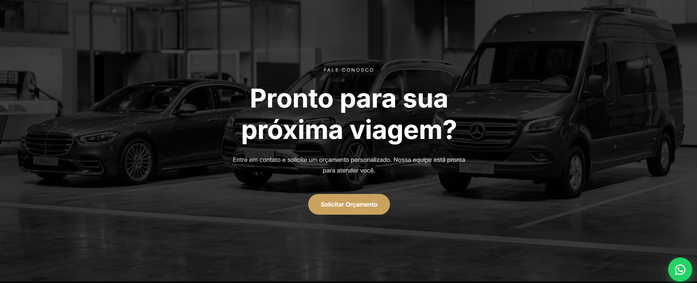

# 🚐 NexTransfer

### Transporte Executivo & Turismo

Landing page institucional para empresa de transporte executivo, desenvolvida com foco em conversão de leads via WhatsApp e visual premium.

 

  

 

## 📋 Sobre o projeto

O **NexTransfer** é um site institucional criado para uma empresa de transporte executivo e turismo, com o objetivo de apresentar a frota de veículos (sedans executivos e vans) e converter visitantes em pedidos de orçamento via WhatsApp.

O foco do projeto foi entregar uma experiência **premium e responsiva**, com identidade visual em preto e dourado remetendo a exclusividade e alto padrão.

## ✨ Funcionalidades

- 🖥️ Design responsivo (desktop, tablet e mobile)
- 🚗 Vitrine da frota de veículos com detalhes de cada modelo
- 💬 Botão flutuante de WhatsApp para contato direto
- 📝 Seção de orçamento personalizado com CTA de conversão
- 🎨 Identidade visual customizada (paleta preto/dourado, tipografia própria)
- ⚡ Performance otimizada para carregamento rápido

## 🛠️ Tecnologias

| Camada           | Tecnologia                            |
| ---------------- | ------------------------------------- |
| Front-end        | HTML5, CSS3, JavaScript               |
| Deploy & Hosting | Netlify (CI/CD automático via GitHub) |
| Versionamento    | Git / GitHub (repositório privado)    |

## 🔒 Sobre o código-fonte

Este é um projeto comercial desenvolvido para um cliente, por isso o **repositório de código é privado**. Este README serve como vitrine do projeto — para conhecer o resultado final, acesse o site ao vivo:

### 🔗 [nextransferrj.netlify.app](https://nextransferrj.netlify.app)

 

**Gostou do projeto? Vamos conversar!**

